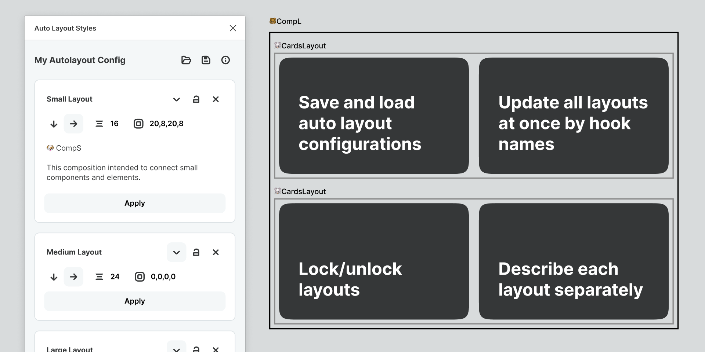

# Figma Auto Layout Styles

### The plugin brings an experience of Figma styles to the auto-layout feature. You can make separate configurations of auto-layouts, save and load them, lock or change at any time.

---

## 🤔 When do I need it?

- If you use the same spacers between certain components or elements.
- If you have a team and want it to use and apply composition rules in a comfortable way.
- If you have multiple projects with different spacer setting and want to keep all in consistency.

---

### 📺 Demo Video [on YouTube](https://youtu.be/vr8asHzyy30)

---

## 🧞‍♂️ How it works

The plugin works in the same way as sharable styles in Figma. But the plugin stores these styles as a JSON file.
You can add so many compositions as you want and save them separately as a compositions configuration.

---

## 🤖 How to use

Before you will start to apply compositions, you need to select two or more elements. Than click “Apply” button and plugin will automatically apply auto-layout styles from the composition card.

---

## 🪢 Hook names

Hook names is a string that will be applied as an auto-layout layer name.

This is important to have distinguish and unique names for each composition, because only with this condition the plugin will be able successfully update multiple composition automatically.

---

## 💣 Update all layouts at once by hook names

If you used the plugin before and adjusted all compositions, each type of composition will have a specific name.

Clicking on the “Update all by hooks” button the plugin will go through all compositions on all file pages and apply compositions styles from you configuration.

---

## 🔒 Lock composition

Each composition can be locked if you want to make your work with the plugin more safely.

---

## 🔗 Links

#### [Figma project](https://www.figma.com/file/MczslX4e8wjNnYTgy57RpI/Figma-Auto-Layout-Styles?node-id=0%3A1)

#### [My website](https://pavellaptev.github.io/)

#### [Support the plugin](https://www.paypal.me/pavellaptev)
